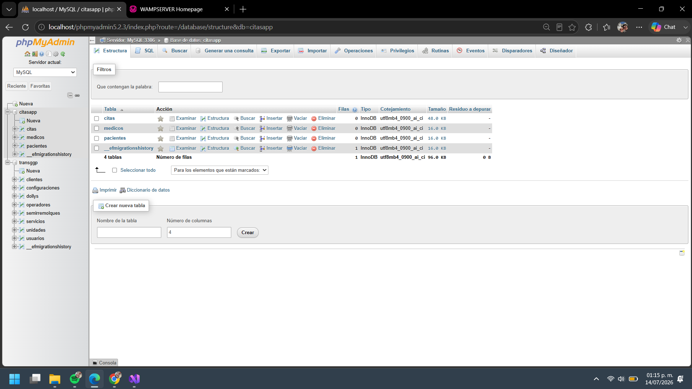
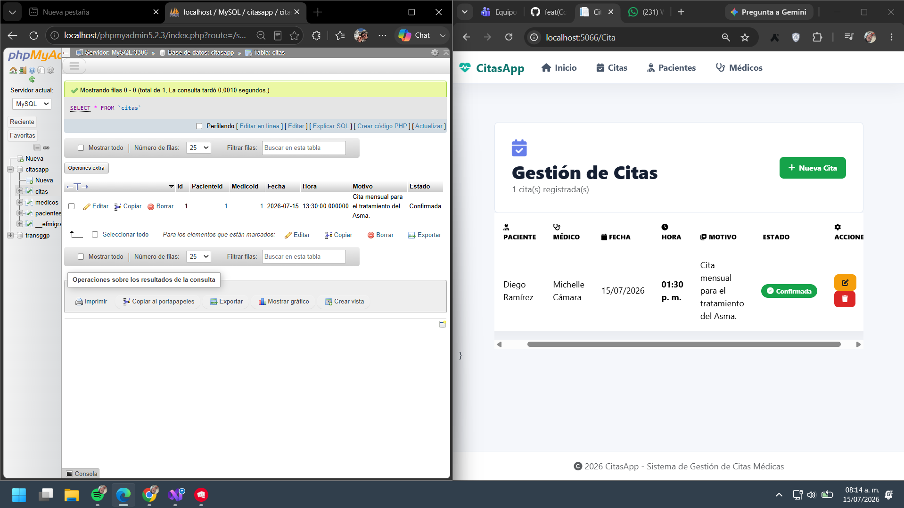
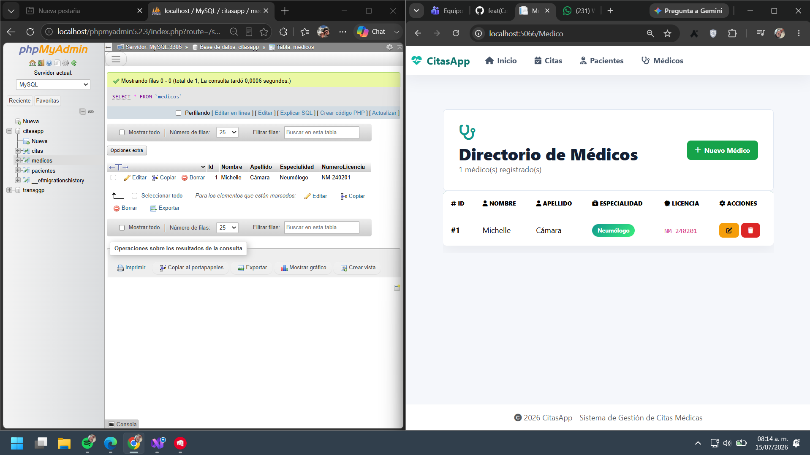
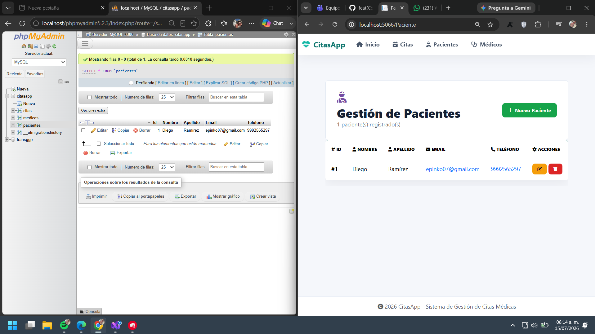

# CitasApp

Aplicación web para la gestión de citas médicas, desarrollada con **ASP.NET Core Razor Pages** y una arquitectura por capas/hexagonal. El proyecto evolucionó desde almacenamiento en archivos JSON hacia **Entity Framework Core + MySQL local** usando WAMP/phpMyAdmin.

## Objetivo

Gestionar pacientes, médicos y citas médicas desde una interfaz web, con persistencia local en base de datos y una estructura de proyecto separada por responsabilidades.

## Tecnologías usadas

- ASP.NET Core Razor Pages
- .NET 10
- Entity Framework Core
- MySQL local con WAMP/phpMyAdmin
- C#
- HTML, CSS y Bootstrap
- Arquitectura hexagonal / por capas

## Estructura de la solución

```text
CitasApp
├── CitasApp.Domain/
│   ├── Models/
│   │   ├── Cita.cs
│   │   ├── Medico.cs
│   │   ├── Paciente.cs
│   │   └── ErrorViewModel.cs
│   └── Interfaces/
│       ├── ICitaRepository.cs
│       ├── IMedicoRepository.cs
│       └── IPacienteRepository.cs
├── CitasApp.Application/
│   └── Services/
│       ├── CitaService.cs
│       ├── MedicoService.cs
│       └── PacienteService.cs
├── CitasApp.Infrastructure/
│   ├── Persistence/
│   │   └── AppDbContext.cs
│   ├── Repositories/
│   │   ├── JsonCitaRepository.cs
│   │   ├── JsonMedicoRepository.cs
│   │   ├── JsonPacienteRepository.cs
│   │   ├── CsvCitaRepository.cs
│   │   ├── CsvMedicoRepository.cs
│   │   ├── CsvPacienteRepository.cs
│   │   ├── LoggingPacienteRepository.cs
│   │   ├── MemoriaPacienteRepository.cs
│   │   └── RepositoryFactory.cs
│   └── Observers/
│       ├── EmailObserver.cs
│       └── SmsObserver.cs
├── CitasApp.Web.csproj
├── Program.cs
├── Controllers/
├── Views/
├── wwwroot/
└── Data/
```

## Capas del proyecto

### Domain
Contiene las entidades y las interfaces de repositorio. Aquí viven los contratos del negocio.

### Application
Contiene los servicios de aplicación que coordinan reglas de negocio y usan los repositorios.

### Infrastructure
Contiene la implementación técnica:
- `AppDbContext` para EF Core
- repositorios JSON/CSV/memoria
- observadores de notificación

### Web
Es la capa de presentación. Actualmente el arranque principal está en `Program.cs` y la UI está basada en Razor Pages / MVC según el módulo.

## Persistencia actual

La aplicación usa **MySQL local** como base de datos principal.

### Tablas que genera EF Core
- `pacientes`
- `medicos`
- `citas`
- `__efmigrationshistory` 

### Tablas de Identity
Actualmente **no se necesitan**. Si el `AppDbContext` hereda de `DbContext` normal, no deberían aparecer tablas `aspnet...`.

## Deuda técnica identificada

### 1. Persistencia híbrida
Todavía existen repositorios JSON y CSV junto con la base de datos. Eso implica doble mantenimiento y confusión sobre cuál fuente de datos es la oficial.

### 2. Configuración local acoplada al entorno
La aplicación depende de una base de datos local en WAMP/phpMyAdmin. Funciona bien para desarrollo, pero debe revisarse para que la configuración sea portable y compatible con 12-factor.

### 3. Estructura del startup
El proyecto raíz compila como aplicación principal y el subproyecto `CitasApp.Api` debe mantenerse aislado para no mezclar top-level statements ni romper el build.

## Code smells identificados y refactor realizado

### 1. Tight Coupling en `CitaController`
El controlador depende directamente de varios repositorios y repite la carga de catálogos de pacientes y médicos en varias acciones. Esto aumenta el acoplamiento y dificulta el mantenimiento.

### 2. Long Method en `CitaService.ConfirmarCita`
El método concentra varias responsabilidades en una sola operación: validar la cita, cambiar el estado, guardar el cambio, registrar el evento y notificar observadores.

### Refactor aplicado
Se propone y se aplica **Extract Method** en `CitaController` creando el método privado `CargarCatalogos()`, para evitar duplicación y centralizar la carga de datos comunes.

También se aplica **Extract Method** en `CitaService` para reducir el `Long Method` de `ConfirmarCita(int id)`, separando la lógica en métodos más pequeños como `ValidarCita`, `Confirmar`, `GuardarCita` y `RegistrarNotificacion`.

### Resultado del refactor en `CitaService`
El método principal quedó como orquestador de la operación: primero valida si la cita existe, luego confirma el estado, guarda el cambio y finalmente registra la notificación. Con esto se mejora la legibilidad y se corrige el code smell de método largo.

### Pasos seguidos
1. Identificar las acciones donde se repetía la carga de catálogos.
2. Crear el método privado `CargarCatalogos()` dentro de `CitaController`.
3. Reemplazar las líneas repetidas por una sola llamada al método.
4. Dejar preparado `CitaService.ConfirmarCita` como siguiente candidato para más refactorización.

## Base de datos



### Resultados de migración y guardado de datos
Las siguientes capturas muestran la base de datos y las tablas creadas después de aplicar la migración y guardar información desde la aplicación:

- 
- 
- 

## Migración y comandos útiles

### Crear migración
```powershell
dotnet ef migrations add InitialCreate -p ..\CitasApp.Infrastructure\CitasApp.Infrastructure.csproj -s .\CitasApp.Web.csproj
```

### Aplicar migración
```powershell
dotnet ef database update -p ..\CitasApp.Infrastructure\CitasApp.Infrastructure.csproj -s .\CitasApp.Web.csproj
```

## Requisitos

- .NET SDK 10
- MySQL local funcionando con WAMP
- Base de datos creada en phpMyAdmin

## Ejecución

```powershell
dotnet restore
dotnet run --project .\CitasApp.Web.csproj
```

## Imágenes

- 
- 
- 
- 

## Diagramas

- [Diagrama de clases](./Diagramas.md)
