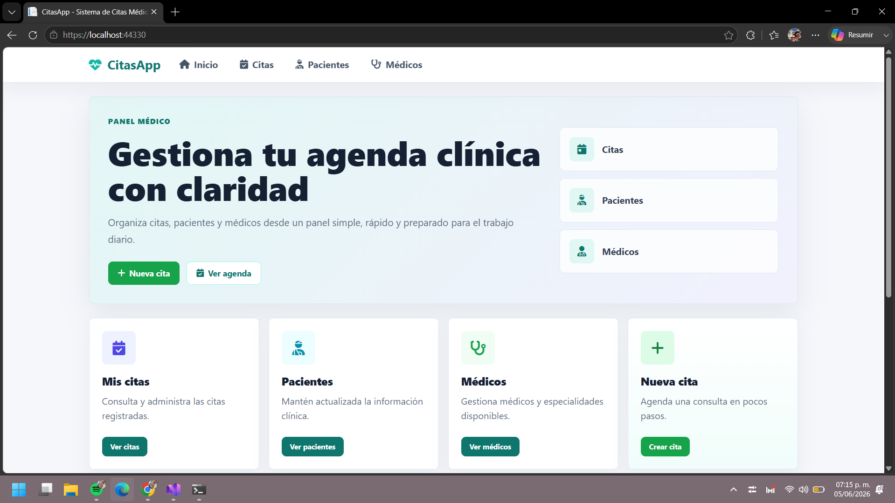
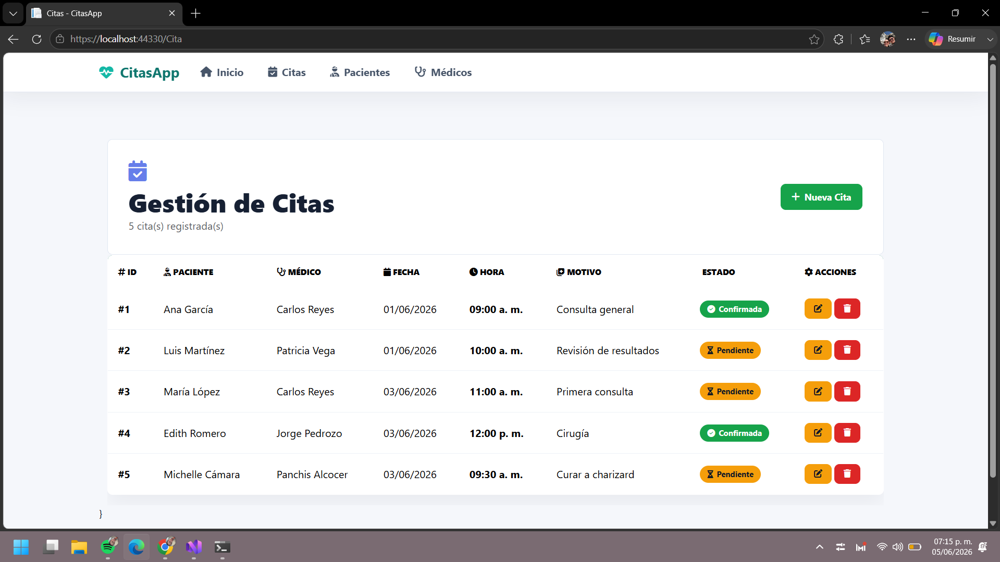
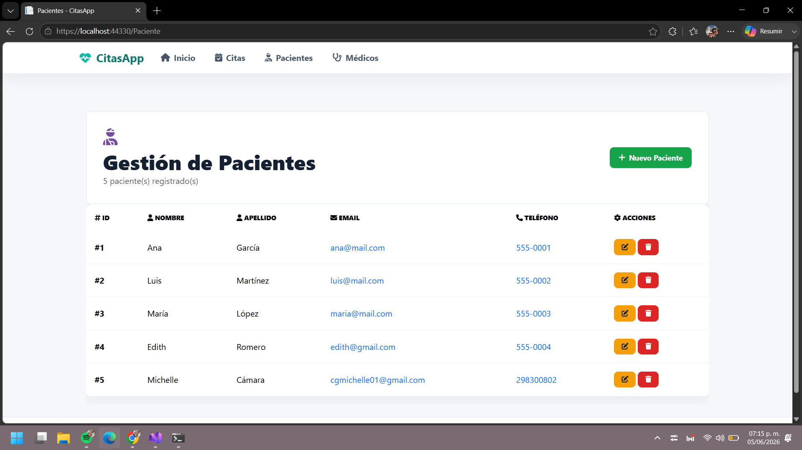
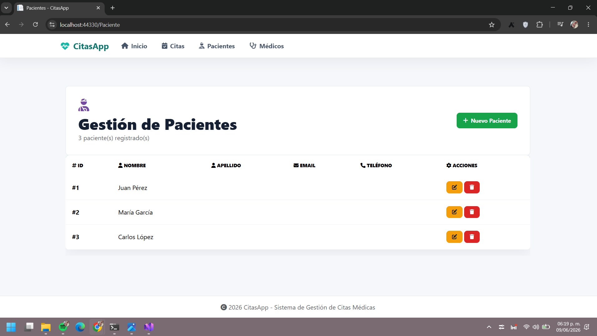

# CitasApp

Es una aplicación web desarrollada con ASP.Net Core MVC para gestionar citas médicas de forma sencilla. Permite administrar
pacientes, médicos y citas desde una interfaz clara y organizada. 

## Objetivo

Realizar una aplicación web para gestionar citas médicas, permitiendo a los usuarios crear, editar y eliminarlas. Además, el objetivo de esta práctica fue cambiar la arquitectura MVC a hexagonal, utilizando archivos JSON para el almacenamiento de datos en lugar de una base de datos tradicional.

## Tecnologías Usadas
 - ASP.Net Core MVC
 - CSS Personalizado
 - Arquitectura Hexagonal
 - Archivos JSON como almacenamiento de datos
 - HTML para las vistas.
 

## Arquitectura
El proyecto está organizado siguiendo la arquitectura hexagonal, donde:
- **CitasApp.Domain**: Contiene las entidades, interfaces y lógica de negocio. Aquí se definen los modelos de datos y las interfaces para los repositorios.
- **CitasApp.Infrastructure**: Implementa las interfaces definidas en el dominio utilizando archivos JSON para el almacenamiento de datos. Aquí se encuentran las clases que manejan la lectura y escritura de datos en formato JSON.
- **CitasApp.Web**: Es la capa de presentación que contiene los controladores, vistas y la configuración de la aplicación. Aquí se manejan las solicitudes HTTP y se renderizan las vistas para el usuario.


## Entidades
- **Cita**: Representa una cita médica, con propiedades como Id, PacienteId, MedicoId y Fecha.
- **Paciente**: Representa un paciente, con propiedades como Id, Nombre, Edad y NumeroContacto.
- **Medico**: Representa un médico, con propiedades como Id, Nombre, Especialidad y NumeroLicencia.


## Estructura del proyecto
  ```text
  CitasApp.sln
├── CitasApp.Domain/
│   ├── Interfaces/
│   │   ├── ICitaRepository.cs
│   │   ├── IMedicoRepository.cs
│   │   └── IPacienteRepository.cs
│   └── Models/
│       ├── Cita.cs
│       ├── ErrorViewModel.cs
│       ├── Medico.cs
│       └── Paciente.cs
├── CitasApp.Infrastructure/
│   └── Repositories/
│       ├── JsonCitaRepository.cs
│       ├── JsonMedicoRepository.cs
│       └── JsonPacienteRepository.cs
└── CitasApp.Web/
    ├── Controllers/
    ├── Views/
    ├── Data/
    └── Program.cs 
  ```

 ## Requisitos

 Antes de ejecutar el proyectio, se debe instalar: 

 - .NET SDK 10 o superior.
 
 ## Cómo ejecutar

 1. Clona o abre el proyecto.
 2. Entra a la carpeta del proyecto
     ```sh
     cd CitasApp
     ```
 3. Restaura las dependencias:
     ```sh
     dotner restore
     ```
 4. Ejecuta la aplicación.
     ```sh
     dotnet run 
     ```
 5. Abre el navegador en la URL que indique.
 
 ## Resultado

 
 

 

 ## Módulos principales

 Muestra un panel principal con accesos rápidos para consultar citas, pacientes, médicos y crear una nueva cita.

 ### Citas
  Permite listar, crear, editar y eliminar citas. Al crear o editar una cita, se selecciona el paciente, el médico y la fecha.

  ### Pacientes
  Permite listar, crear, editar y eliminar pacientes. Cada paciente tiene un nombre, edad y número de contacto.
  
  ### Médicos
  Permite listar, crear, editar y eliminar médicos. Cada médico tiene un nombre, especialidad y número de licencia.

  ## Almacenamiento de datos
  Actualmente, la aplicación utiliza archivos JSON dentro de la carpeta Data para almacenar la información de citas, pacientes y médicos. Esto facilita la gestión de datos sin necesidad de configurar una base de datos.

  ## Nuevo Adaptador
 Se implementó *MemoriaPacienteRepository* como un nuevo adaptador para el repositorio de pacientes, permitiendo almacenar los datos en memoria en lugar de archivos JSON. Esto es útil para pruebas rápidas o para escenarios donde no se requiere persistencia a largo plazo.
 A continuación, se muestra el cambio que tuvo la aplicación una vez llamado el adaptador.
 

  ## Ramas
  - **main**: Contiene la versión final del proyecto con la arquitectura MVC y el uso de archivos JSON para el almacenamiento de datos.
  - **hexagonal**: Contiene la versión del proyecto con la arquitectura hexagonal y el uso de archivos JSON para el almacenamiento de datos.
  - **GOF**: Contiene la versión del proyecto con la arquitectura hexagonal y el uso de archivos JSON para el almacenamiento de datos, además de la implementación de patrones **GOF**.

  
## Endpoints API REST
- `GET /api/pacientes` — lista de pacientes
- `GET /api/pacientes/{id}` — detalle de un paciente
- `GET /api/medicos` — lista de médicos
- `GET /api/medicos/{id}` — detalle de un médico
- `GET /api/citas` — agenda completa
- `GET /api/citas/porpaciente/{pacienteId}` — citas de un paciente
- `POST /api/citas/confirmar/{citaId}` — confirma una cita y dispara notificaciones
- 

## Patrones GOF implementados

- **Factory** (`RepositoryFactory`) — selecciona el repositorio según el entorno (Development → JSON, Production → Memoria)
- **Decorator** (`LoggingPacienteRepository`) — agrega logging con timestamp sin modificar el repositorio original
- **Observer** (`SmsObserver`, `EmailObserver`) — notifican automáticamente al confirmar una cita sin acoplar CitaService a los canales de notificación


  ## Cláusula de IA
 El cambio realizado de la estructura arquitectónica de MVC fue realizado con las diapositivas y los conocimientos obtenidos durante el curso. No se utilizó Inteligencia Artificial actualmente para nada más que la estructura del proyecto del README.md.
